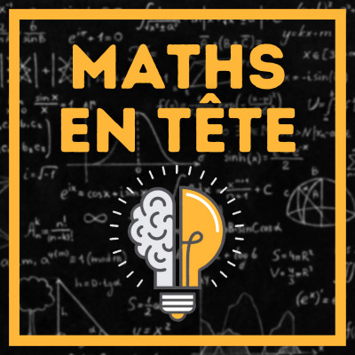
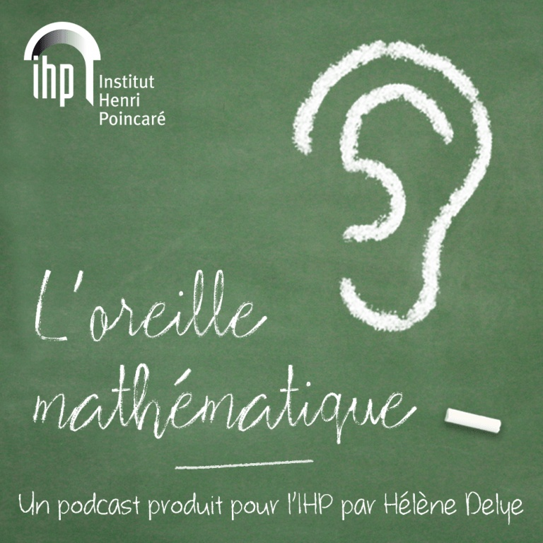
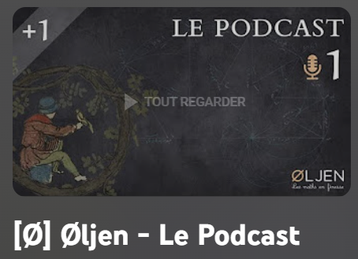

Contrairement aux blogs et aux vidéos, les podcasts sont faciles à consommer, car ils peuvent être écoutés en réalisant d'autres activités.

Les mathématiques n’échappent pas au phénomène des podcasts, et des scientifiques s’en sont emparés avec grand talent. Dans cette surprise, nous vous en faisons découvrir trois.

  

---

### 1. Maths en tête : le podcast

  

Alexandre Morgan, auteur du site [Maths en tête](https://www.mathsentete.fr/), a commencé [un podcast](https://www.mathsentete.fr/podcast) de vulgarisation mathématique en novembre 2021. Il est accessible à tous, même pour ceux qui pourraient être fâchés avec les maths. Chaque nouvel épisode sort les mercredis et est attendu avec impatience.

Les sujets sont très diversifiés, et tout devient clair et passionnant dans des podcasts à la fois courts et très riches. Cela va de « L’art de mélanger les cartes » à « Pourquoi les bouteilles de vin font-elles 75 cl ? » en passant par « Al-Kashi, plus fort que Pythagore ». Alexandre aborde même la question suivante sous un angle mathématique : « Est-ce mathématiquement raisonnable d'être sage pour Noël ? ».

Une partie de ses podcasts est aussi disponible sur la chaîne Science infuse, qui s’enrichit de podcasts mathématiques : [voir la liste ici](https://docs.google.com/document/d/1r1k4p-IedsObbc4TB4WMOaSEjRL9n6baf9Asq28ojWQ/edit).

Retrouvez également Alexandre sur son site [Maths en tête](https://www.mathsentete.fr/) ou sa [chaîne YouTube](https://www.youtube.com/channel/UCpbU7mXDloketKRA92AcW7Q). On pourra aussi écouter son interview dans le podcast [Parcours Mathématiques](https://www.youtube.com/watch?v=RX-oB4zoW7k) de Laurène Guidetou.

---

### 2. L’oreille mathématique

  

[**L’oreille mathématique**](https://maison-des-maths.paris/podcasts/) est un podcast dédié aux mathématiques et à la physique théorique produit pour l’Institut Henri Poincaré par Hélène Delye depuis novembre 2019. C’est une conversation mensuelle avec un mathématicien ou une mathématicienne pour mettre en lumière le tempérament et les idées de celles et ceux qui font les mathématiques contemporaines.

On y découvre les mathématiques et les parcours de chercheurs, mais aussi parfois d’ingénieurs ou de professeurs du secondaire, comme l’interview de [Houria Lafrance](https://maison-des-maths.paris/houria-lafrance/), fondatrice de l’association *Les Maths en Scène*. Les podcasts ne sont pas techniques et sont accessibles à tous. Merci à l’Institut Henri Poincaré pour ce podcast.

---

### 3. Øljen : le podcast

  

Olivier Geneste, après avoir enseigné en classes préparatoires, a lancé le podcast [Øljen - Les maths en finesse](https://www.youtube.com/playlist?list=PLkj0p5n3uJ6xrolg_GTSQr6913ABqtqKu). Ce podcast est accessible sur différentes plateformes de diffusion et sur sa chaîne YouTube.

Avec sa voix rassurante, il prodigue des conseils et explications : découvrez *les marches aléatoires* ou ses supers conseils d’apprentissage valides pour quiconque souhaite progresser. 

Retrouvez aussi sa chaîne YouTube [Øljen - Les maths en finesse](https://www.youtube.com/c/oljenmaths/featured), qui propose des vidéos allant du niveau lycée aux classes préparatoires, et même au-delà. Pour les amateurs d’énigmes, une playlist dédiée est disponible : [les énigmes du professeur Layton](https://www.youtube.com/playlist?list=PLkj0p5n3uJ6xs194fG1XZCCz-1e3irBmP).

Merci à Olivier pour son travail et ses contributions pédagogiques.

---

### Origine de cet article

Ce post a été publié initialement le **14 décembre 2022** dans les surprises du Calendrier de l'Avent Mathématiques Les Maths En Scène.  
Retrouvez la version originale ici : [Surprise du 14 décembre 2022](https://jeux.lesmathsenscene.fr/avent-2022/surprises/Q-ZUBW4gO3jw0nWmFQRoY25zq68T3f2LGy/).
