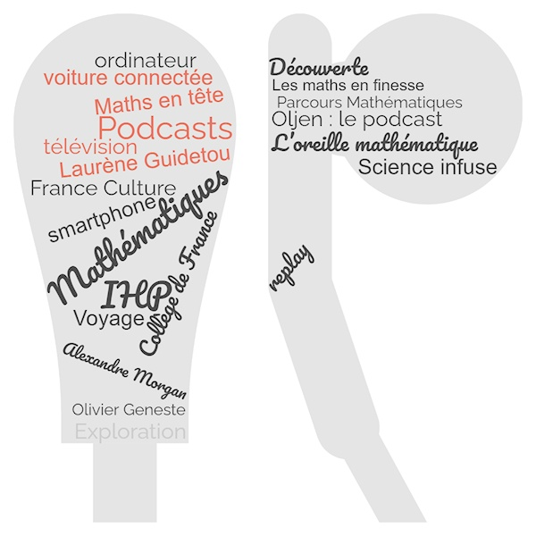
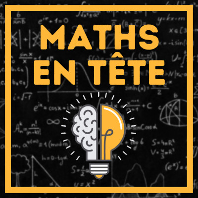
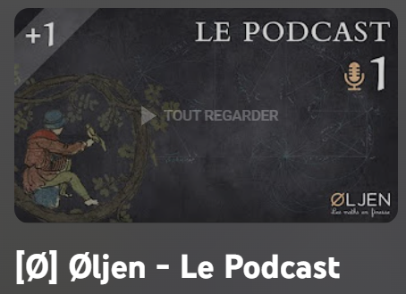

  
Contrairement aux blogs et aux vidéos, les podcasts sont faciles à consommer, car ils peuvent être écoutés en réalisant d'autres activités.

Les mathématiques n’échappent pas au phénomène des podcasts et des scientifiques s’en sont emparés avec grand talent. Dans cette surprise nous vous en faisons découvrir trois.

  

---

### 1. Maths en tête : le podcast

  

Alexandre Morgan auteur du site [Maths en tête](https://www.mathsentete.fr/) a commencé [un podcast](https://www.mathsentete.fr/podcast) de vulgarisation mathématique en novembre 2021. Il est accessible à tous et même pour ceux qui pourraient être fâchés avec les maths. Chaque nouvel épisode sort les mercredis et est attendu avec impatience.

Les sujets sont très diversifiés et tout devient clair et passionnant dans des podcasts à la fois courts et très riches. Cela va de « L’art de mélanger les cartes » à « Pourquoi les bouteilles de vin font-elles 75 cl ? » en passant par « Al-Kashi, plus fort que Pythagore ». Alexandre aborde même la question suivante sous un angle mathématique : « Est-ce mathématiquement raisonnable d'être sage pour Noël ? » sujet qui nous préoccupe tous à quelques jours de Noël. Une partie de ses podcasts sont aussi sur la chaîne Science infuse qui s’enrichit de podcasts mathématiques : [on en trouvera la liste ici](https://docs.google.com/document/d/1r1k4p-IedsObbc4TB4WMOaSEjRL9n6baf9Asq28ojWQ/edit). Merci à Alexandre Morgan pour ce podcast.

Et si vous êtes gourmands de mathématiques, vous le retrouverez sur son site [Maths en tête](https://www.mathsentete.fr/) ou sa [chaîne YouTube](https://www.youtube.com/channel/UCpbU7mXDloketKRA92AcW7Q). On pourra aussi écouter son interview dans le podcast [Parcours Mathématiques](https://www.youtube.com/watch?v=RX-oB4zoW7k) de Laurène Guidetou (disponible sur toutes les plateformes de podcast).

---

### 2. L’oreille mathématique

  

[**L’oreille mathématique**](https://maison-des-maths.paris/podcasts/) est un podcast dédié aux mathématiques et à la physique théorique produit pour l’Institut Henri Poincaré par Hélène Delye depuis novembre 2019. C’est une conversation mensuelle avec un mathématicien ou une mathématicienne pour mettre en lumière le tempérament et les idées de celles et ceux qui font les mathématiques contemporaines. On y découvrira les mathématiques et les parcours de chercheurs mais aussi parfois d’ingénieurs ou de professeurs du secondaire (voir l’interview de [Houria Lafrance](https://maison-des-maths.paris/houria-lafrance/), fondatrice de l’association *Les Maths en Scène*). Les podcasts ne sont pas techniques, sont accessibles à tous ceux qui sont intéressés de savoir ce qui anime et passionne ses créateurs et passeurs de mathématiques. Merci à l’Institut Henri Poincaré d’avoir créé ce podcast.

---

### 3. Øljen : le podcast

  

Olivier Geneste a enseigné plusieurs années en classes préparatoires. En plus de donner le goût des mathématiques et de les enseigner à ses élèves, il a pensé à les accompagner dans leur apprentissage avec le podcast [Øljen - Les maths en finesse](https://www.youtube.com/playlist?list=PLkj0p5n3uJ6xrolg_GTSQr6913ABqtqKu) qui est accessible sur les différentes plateformes de diffusion et sur sa chaîne YouTube dans la playlist [Øljen - Le Podcast.](https://www.youtube.com/playlist?list=PLkj0p5n3uJ6xrolg_GTSQr6913ABqtqKu)

Laissez-vous accompagner par cette voix rassurante qui nous accueille par « Sois le bienvenu !» et nous prodigue plus de conseils et d’explications que l’on n’aurait jamais espéré avoir : allez y découvrir *les marches aléatoires* pour acquérir une connaissance solide. Ses supers conseils d’apprentissage sont en fait valides pour n’importe qui souhaitant apprendre et progresser rapidement sur un sujet.

On trouvera également sur sa chaine YouTube [Øljen - Les maths en finesse](https://www.youtube.com/c/oljenmaths/featured) des vidéos de grande qualité allant des maths de niveau lycée jusqu'au niveau des classes préparatoires et même au delà. J’avais cru comprendre que les mathématiciens adorent les tableaux noirs pour échanger : on les retrouve bien ici, via une tablette graphique, avec un style impeccable. Les amateurs d’énigmes pourront aussi suivre la playlist [les énigmes du professeur Layton](https://www.youtube.com/playlist?list=PLkj0p5n3uJ6xs194fG1XZCCz-1e3irBmP).

Grâce à ses activités en ligne, Olivier accompagne énormément d’élèves dans leurs apprentissages et de personnes « en quête » de savoir mathématique. Alors un grand merci à Olivier.

---

### Origine de cet article
Ce post a été publié initialement le **14 décembre 2022** dans les surprises du Calendrier de l'Avent Mathématiques Les Maths En Scène.  
Retrouvez la version originale ici : [Surprise du 14 décembre 2022](https://jeux.lesmathsenscene.fr/avent-2022/surprises/Q-ZUBW4gO3jw0nWmFQRoY25zq68T3f2LGy/).

